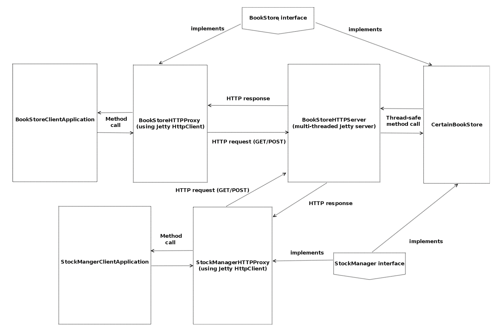

# High-Performance RPC & Multithreading Java Server

## Overview
This project is a high-performance, modular, and scalable Java-based server implementing **Remote Procedure Calls (RPC)** and **Multithreading**. It was developed as part of the *Advanced Computer Systems* course and is designed to simulate a **distributed bookstore service** handling concurrent client requests with strong consistency guarantees. The architecture follows **strong modularity principles**, ensuring seamless extensibility and high reliability. Future enhancements are planned to further optimize concurrency control and introduce additional distributed computing capabilities.

## Key Features
- **RPC-Based Communication:** Clients interact with the server via HTTP-based remote procedure calls (RPCs), enabling modular and loosely coupled interactions.
- **Multithreaded Processing:** Implements fine-grained concurrency control to handle a high volume of concurrent client requests efficiently.
- **Atomic Operations & Consistency Guarantees:** Employs robust transaction handling to ensure before-or-after atomicity across concurrent operations.
- **Two-Level Locking Protocol:** Enhances performance and scalability by utilizing a hierarchical locking strategy.
- **Scalable & Fault-Tolerant Architecture:** Designed to support web proxies for load balancing and failover handling.
- **Extensible Design:** Built to support future integrations with caching mechanisms and distributed computing frameworks.

## Architecture
The project is structured around a **client-server model** where clients interact with the bookstore system through dedicated APIs.

### Components
1. **BookStore Server** - Handles client requests and processes them using an HTTP-based RPC mechanism.
2. **StockManager Interface** - Allows bookstore administrators to manage inventory.
3. **BookStore Client Interface** - Enables customers to browse and purchase books.
4. **Concurrency Control Mechanisms**
   - *SingleLockConcurrentCertainBookStore:* Employs a single global read-write lock to ensure atomic operations.
   - *TwoLevelLockingConcurrentCertainBookStore:* Implements a two-tiered locking strategy for higher concurrency.

## Performance & Scalability
- **Optimized for Concurrent Requests:** By leveraging multithreading and efficient locking mechanisms, the server maintains strong isolation and high throughput under concurrent workloads.
- **Web Proxy Compatibility:** The design allows for the use of proxy servers to handle a large number of simultaneous connections efficiently.
- **Fault-Tolerance Considerations:** Future extensions include integrating distributed logging and failover mechanisms to enhance reliability.

## Technical Stack
- **Programming Language:** Java (OpenJDK 15)
- **Networking:** HTTP-based RPC (Jetty HTTP server & client libraries)
- **Serialization:** XML & Binary formats (XStream & Kryo libraries)
- **Concurrency Handling:** `java.util.concurrent.locks.ReadWriteLock`
- **Testing Framework:** JUnit (unit and concurrency tests)

## Future Enhancements
This project is actively being extended to include:
- **Distributed Caching:** To optimize response times and reduce server load.
- **Database Integration:** Moving towards a persistent backend to manage bookstore data.
- **Load Balancing Strategies:** Exploring adaptive concurrency mechanisms and distributed processing solutions.
- **Advanced Failure Recovery:** Implementing checkpointing and rollback mechanisms for crash recovery.

## Why This Matters to Large-Scale Systems
This project showcases expertise in building **scalable, concurrent, and fault-tolerant systems**, fundamental to large-scale enterprise applications. The design choices, including **RPC communication, multithreaded processing, and hierarchical locking**, align with industry best practices for high-performance server development.

## Conclusion
Developed as part of an advanced systems course, this Java-based RPC server demonstrates strong modularity, concurrency control, and scalability. With ongoing improvements, it serves as an excellent foundation for real-world distributed systems and high-traffic enterprise applications.
